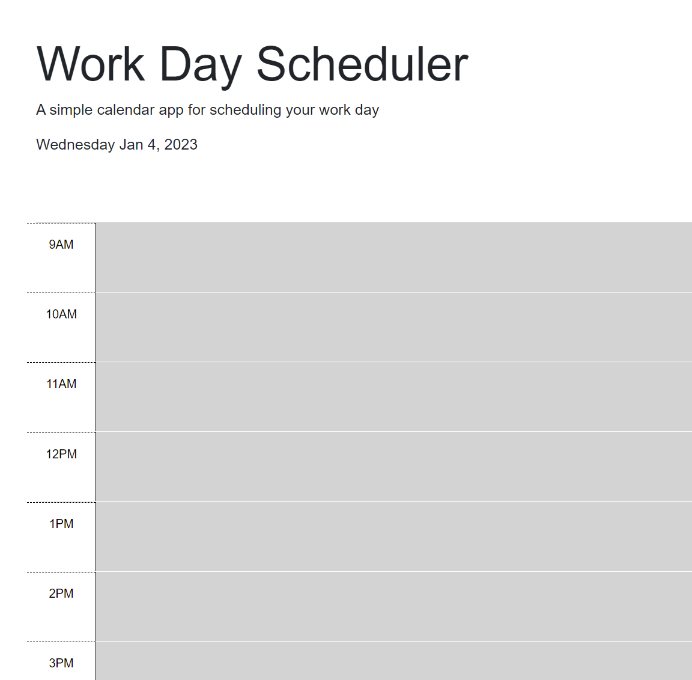

# Work Day Scheduler

## Description
This application allows a user to save events for each hour of the workday. The user can input their tasks for the day, and these tasks will save upon page refreshes.

## Installation
N/A

## Usage
Use this application to track agenda items or tasks you would like to accomplish during the workday.

## Deployed Site
https://mtstall.github.io/work-day-scheduler/

## Credits
N/A